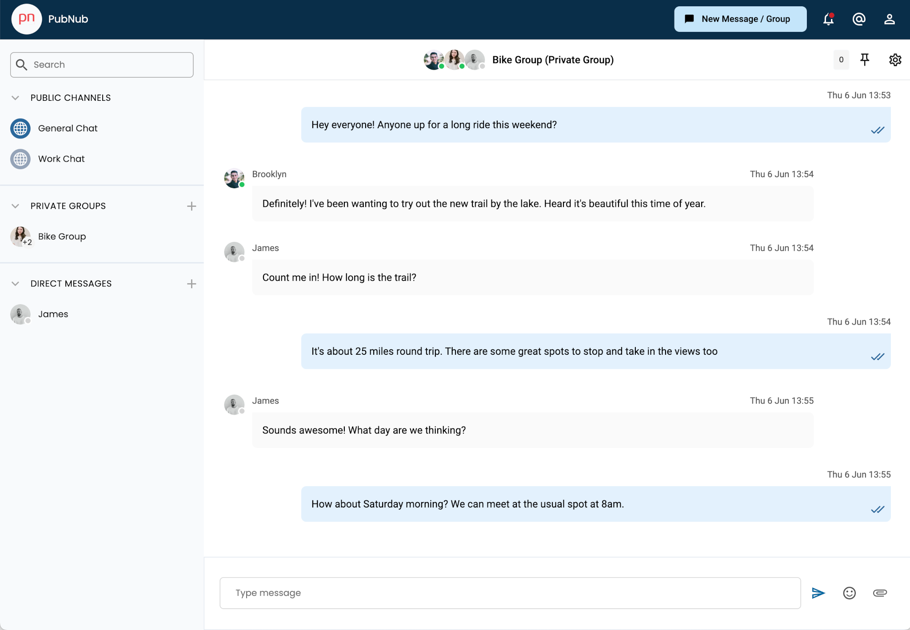
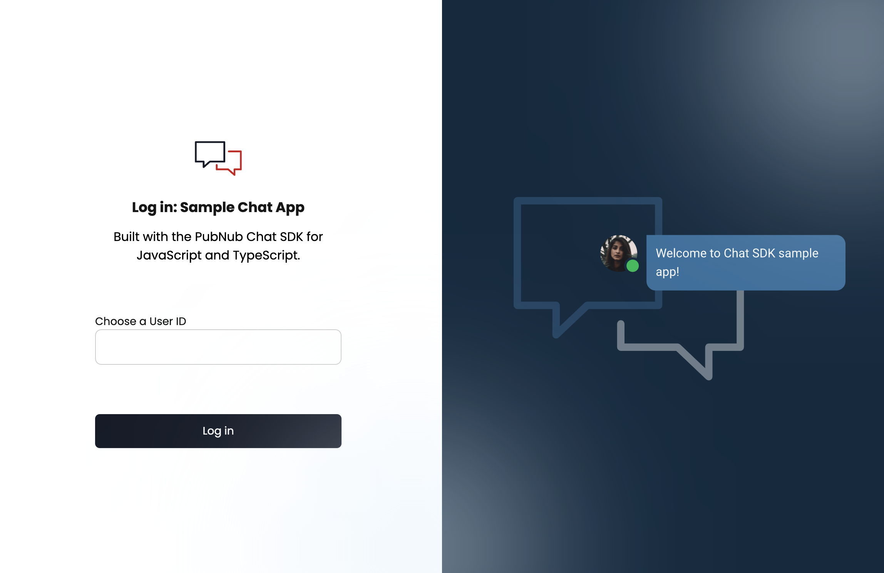
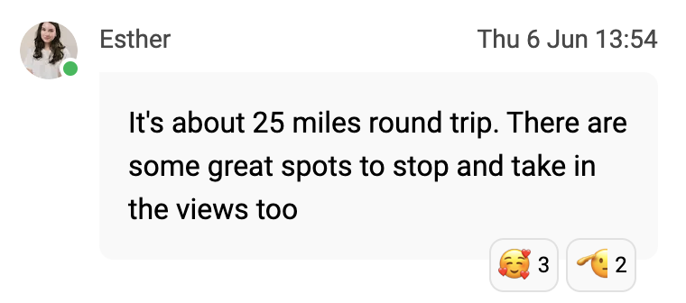
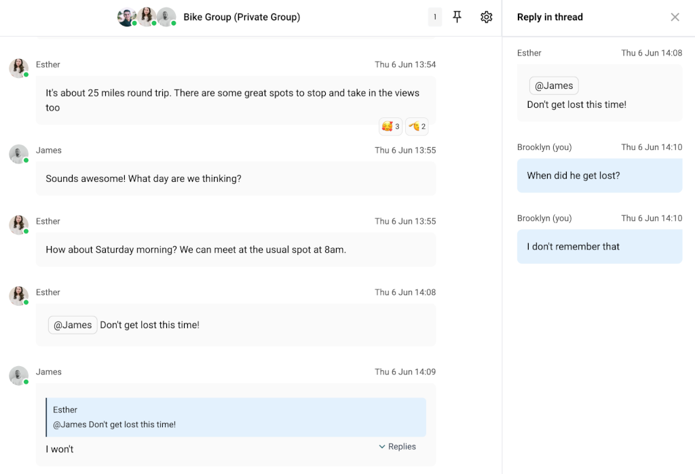
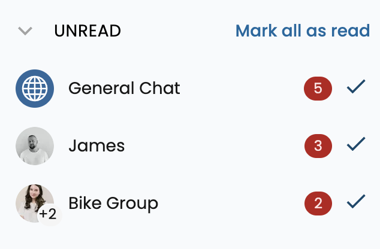
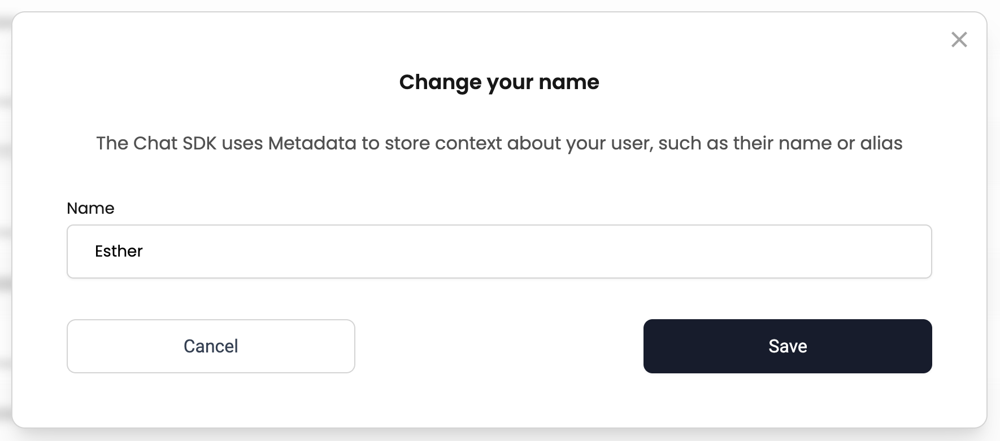

# Chat SDK Demo Application for the Web

## Demo

A hosted version of this demo can be found at **[https://chat-sdk-demo-web.netlify.app/](https://chat-sdk-demo-web.netlify.app/)**



## Installation / Getting Started

This application is written with NextJS, so be sure to have a copy of [Node.js 18.17](https://nodejs.org/) or later installed.

To run this project yourself you will need a PubNub account

<a href="https://admin.pubnub.com/signup">
	
</a>

### Get Your PubNub Keys

1. You’ll first need to sign up for a [PubNub account](https://admin.pubnub.com/signup/). Once you sign up, you can get your unique PubNub keys from the [PubNub Developer Portal](https://admin.pubnub.com/).

1. Sign in to your [PubNub Dashboard](https://admin.pubnub.com/).

1. Click Apps, then **Create New App**.

1. Give your app a name, and click **Create**.

1. Click your new app to open its settings, then click its keyset.

1. Enable the Stream Controller feature on your keyset (this should be enabled by default after you created the keyset)

1. You can leave the Presence feature disabled, this app uses the [Global Presence](https://www.pubnub.com/docs/chat/chat-sdk/build/features/users/presence#global-presence) feature of the Chat SDK instead, explained later.

1. Enable the Message Persistence feature on your keyset and choose a duration

1. Enable the App Context feature on your keyset.  **Check** the following boxes: `User Metadata Events`, `Channel Metadata Events`, `Membership Events`.  **Uncheck** the following boxes: `Disallow Get All Channel Metadata`, `Disallow Get All User Metadata`

1. Leave the File Sharing feature disabled.  Although the Chat SDK supports sending files, this demo app does not.

1. Copy the Publish and Subscribe keys and paste them into your app as specified in the next step.

## Building and Running

1. Clone the repository

1. Replace the `.env.sample` file with a `.env` file and populate it with the publish and subscribe keys you generated in the previous step.

1. `cd chat-sdk-demo-web`

1. `yarn install`

1. `yarn dev`

1. You can now navigate to `localhost:3000` in your browser

# Features

## Logging in

Enter any name at the log-in screen.  You do not need to pre-register, the application will create a new user for you based on your chosen name.  If this is the first time running the application, it will also generate 2 public test channels.  To log in as a different user, simply choose a different name at the login screen.

**Be aware:** The created user is not deleted, so you can log in again and your message history and groups will be retained.  Be mindful of this when running on the hosted demo, others can see your history and could easily log in as you if needed.  Obviously this has been made deliberately permissive for demo purposes, in a production application, you would lock login logic behind some form of registration and authentication.  **The demo only persists messages for 1 day**, so if you log in again after this time, you will no longer see your messages.



## Public Channels

When you first login you will see 2 public channels have already been created.  These **public** channels are a specific type of channel defined by the Chat SDK designed for open conversation that anybody can join but there are some limitations, such as read receipts and typing indicators not being available on public channels.  To create a public channel, call the [chat.createPublicConversation](https://www.pubnub.com/docs/chat/chat-sdk/build/features/channels/create#create-public-channel) API

```typescript
await chat?.createPublicConversation({
channelId: 'public-general',
channelData: {
    name: 'General Chat',
    description: 'Public group for general conversation',
    custom: {
    profileUrl: '/group/globe1.svg'
    }
}})
```

**Demo Limitations †:** This demo does not allow you to join or leave a public channel, only the pre-configured 2 channels are supported.  Only the most recently created 40 members are shown as being part of the channel. 

## Sending and Receiving Messages

There are two ways to send messages using the Chat SDK, the simplest is to just specify the text you want to send, but the SDK also offers a more feature-rich [Mesasge Draft](https://www.pubnub.com/docs/chat/chat-sdk/build/features/messages/drafts) workflow that allows for quoted messages, and mentioning users / channels.  This demo uses both ways of sending messages, with the simpler [channel.sendText](https://www.pubnub.com/docs/chat/chat-sdk/build/features/messages/send-receive#send) used for threaded replies, and Message Draft used everywhere else.

To receive messages you must call [connect()](https://www.pubnub.com/docs/chat/chat-sdk/build/features/channels/watch) on the channel you want to receive messages on:

```typescript
useEffect(() => {
    if (!channel) return
    return channel.connect((message) => setMessages((messages) => [...messages, message]))
}, [channel])
```

**Demo Limitations †:** The demo does not allow you to [delete](https://www.pubnub.com/docs/chat/chat-sdk/build/features/messages/delete), [restore](https://www.pubnub.com/docs/chat/chat-sdk/build/features/messages/restore), [forward](https://www.pubnub.com/docs/chat/chat-sdk/build/features/messages/forward) or [edit](https://www.pubnub.com/docs/chat/chat-sdk/build/features/messages/updates) sent messages, though ALL of these are possible using the Chat SDK

### Message Input

This demo features a fairly standard user input


**Demo Limitations †:** The emoji picker will allow you to insert emoji into your message, but this is not specifically part of the Chat SDK.  The SDK (and PubNub) supports all Unicode characters, including emoji.  This demo does not support sending files, but you **can** [send files using the Chat SDK](https://www.pubnub.com/docs/chat/chat-sdk/build/features/messages/files) 

### Message History

When you switch to a different channel, the historical messages sent on that channel are read in using the `getHistory()` method.

```typescript
channel.getHistory({
    startTimetoken?: string,
    endTimetoken?: string,
    count?: number
}): Promise<{
    messages: Message[],
    isMore: boolean
}>
```

**Demo Limitations †:** 
- The demo will only load in the past 20 messages, with no UI given to 'load more...'.  The Chat SDK supports a flexible API, shown above, that allows you to specify the start and end time to read messages from, as well as telling you if there are more messages available - the demo uses none of these features :) .  
- The demo does not cache any of the historical responses, so every time you switch channels it will call the `getHistory()` api anew - in your production application, you will likely cache the response after the first call to getHistory().  
- The keyset for the hosted demo only persists messages for 1 day, so if you revisit the demo after 24 hours you will find your messages have disappeared.

## The Message Actions Bar

If you hover over a message you will see the message actions bar


### Reacting to a Message (Emoji)

Select the Reaction icon from the message actions bar to be presented with the emoji picker.  This is a third party picker that is not part of the Chat SDK.

Once the message has an emoji, you (or someone else in the same channel) can click on the emoji to react again.



The Chat SDK supports [Message Reactions](https://www.pubnub.com/docs/chat/chat-sdk/build/features/messages/reactions) and you can listen for other people reacting using the [Message.streamUpdatesOn](https://www.pubnub.com/docs/chat/chat-sdk/build/features/messages/updates#get-message-updates) API

```typescript
useEffect(() => {
  //  UseEffect to receive updates to messages such as reactions.  This does NOT include new messages being received on the channel (which is handled by the connect elsewhere)
  if (!messages || messages.length == 0) return
  return pnMessage.streamUpdatesOn(messages, setMessages)
}, [messages])
```

**Demo Limitations †:** The demo UI for reactions could have been better, as it sometimes overlaps the message actions bar or the 'replies' text (for threads)... this is only my fault, but I am sure you will do a better job in your production app.

### Quoting a Message

Select the quote icon from the message actions bar to quote an existing message.  This is using the [addQuote()](https://www.pubnub.com/docs/chat/chat-sdk/build/features/messages/quotes#quote-message) API and requires the [Message Draft](https://www.pubnub.com/docs/chat/chat-sdk/build/features/messages/drafts) workflow.  


Once sent, the quoted message will be shown within the sent message, retrieved with the [getQuotedMessage()](https://www.pubnub.com/docs/chat/chat-sdk/build/features/messages/quotes#get-quoted-message) API

**Demo Limitations †:** The demo does not allow you to remove a quoted message, though this is supported by the Chat SDK

### Pinning a Message

To pin a message click the pin icon in the message actions bar.  Note that at the time of writing, the Chat SDK only allows you to pin one message to a channel.  The pinned message will appear at the top of the channel and labelled as such. 


To unpin the message, use the message actions bar again.

The APIs to pin messages are detailed under the [Pinned messages documentation](https://www.pubnub.com/docs/chat/chat-sdk/build/features/messages/pinned) and this demo uses the variant of the API which acts on the channel:

```typescript
//  Pin the message
let channel = await localActiveChannel?.pinMessage(data)
//  Is the message pinned?
let isPinned = await channel?.getPinnedMessage()
//  Unpin the message
await channel?.unpinMessage()
```

Note that the `pinMessage()` API returns a Promise<Channel>, on which subsequent calls should be invoked. 

**Demo Limitations †:** 
- Typically a pinned message would include a link to 'Show message...' which would scroll the message list to the location of the message - this demo does not implement this feature but our [Chat SDK Demo for mobile](https://github.com/pubnub/js-chat/tree/master/samples/react-native-group-chat) does
- Messsages cannot be pinned to threads, though this feature is supported by the Chat SDK

### Replying to a Message in a Thread

Selecting the reply option from the message actions bar will bring up the 'Reply in Thread' window.



The code will first test whether the selected message has an associated thread and then either create the new thread (which returns a [ThreadChannel](https://www.pubnub.com/docs/chat/chat-sdk/learn/chat-entities/thread-channel)), or retrieves the existing thread:

```typescript
if (!message.hasThread) {
    setActiveThreadChannel(await message.createThread())
} else {
    setActiveThreadChannel(await message.getThread())
}
```

**Demo Limitations †:** - A lot of features **present in the Chat SDK** for threads are unsupported by this demo:
- You are unable to quote messages in a thread, or react to them with emoji
- You are unable to mention users or channels in a threaded channel
- You can not pin messages to a thread, nor pin messages to the parent channel from a thread

### Copying a Message's text

The final message action allows you to copy a message's text to the clipboard.  This doesn't use the Chat SDK, other than to retrieve the message's text content with [message.text](https://www.pubnub.com/docs/chat/chat-sdk/build/features/messages/details#get-message-content).  

**Demo Limitations †:** This will only return the text of a message, so for example mentioned users will only have their name copied and lose the context that they were mentioned.

## Creating a new Message / Group

Although the demo will pre-configure 2 public channels for you, the other two types of channel, `Direct (1:1)` and `Group` can be created using the 'New Message/ Group' button


The resulting screen allows you to search users by name (or user ID).


This is performing a filter on the server to return the top matches for whatever is typed

```typescript
chat.getUsers({
    limit: 10,
    filter: `name LIKE "*${term}*" || id LIKE "*${term}*"`
    }) //  Could also filter by Profile URL:  || profileUrl LIKE "*${term}*"
    .then(userResults => {
    setSearchResults(userResults.users)
    })
```

To create a 1:1 chat, select just one other user and press 'Create'.  To create a group, select 2 or more additional collaborators.

**Demo Limitations †:** This demo caps the number of group members at 10, but the Chat SDK's limit is 100 members.  Note that if you need more than 100 people in a channel, you should be using a `public` channel

## Private Groups

When you create a private group, the create call looks as follows:

```typescript
const { channel } = await chat.createGroupConversation({
    users: others,
    channelData: { name: randomNewChannelName }
})
```

At this point, any [User](https://www.pubnub.com/docs/chat/chat-sdk/learn/chat-entities/user) referenced in the `users` array is considered a member of the created channel.  

The next step is to ensure the user is aware they were made part of a channel.  This is handled by the [invite](https://www.pubnub.com/docs/chat/chat-sdk/build/features/channels/invite) workflow.  To be clear, by calling `createGroupConversation()` we do not need to call `invite()` also, since that is handled automatically by the Chat SDK, but we do need to listen for the [invite event](https://www.pubnub.com/docs/chat/chat-sdk/build/features/custom-events#events-for-channel-initations)

```typescript
const removeInvite = chat.listenForEvents({
    channel: chat.currentUser.id,
    type: 'invite',
    callback: async evt => {
        //  Somebody has added us to a new group chat or DM
        //  do something
    }
})
```

**Demo Limitations †:** If automatically accepting an invite feels very trusting, it is, but in production an application would use the [Access Manager](https://www.pubnub.com/docs/chat/chat-sdk/learn/access-control) to determine who is able to create new groups, and the client may arbitrate with a server, the latter being responsible for authenticating the request and creating the channel.

## Direct (1:1) Conversation

When you create a Direct (1:1) conversation, the create call looks as follows:

```typescript
const { channel } = await chat.createDirectConversation({
    user: otherUser
})
```

Everything mentioned in the previous section about Private Groups also applies to direct conversations, including how to listen for events.

## Group Settings

Selecting the cog / gear icon to the right of the channel will bring up that chat's settings.  From here you can change the name of the group (for private groups) or leave the chat (for direct conversations)


The Chat SDK allows you to specify [custom data for the channel](https://www.pubnub.com/docs/chat/chat-sdk/learn/chat-entities/channel#properties), including `name?` and `description` fields as well as a more free-form `custom` field.

The demo allows you to modify the `name` field as shown in the above screenshot.  When you change the group name, **this change is propagated to all other members in realtime** and users should listen for changes with the [Channel.streamUpdatesOn](https://www.pubnub.com/docs/chat/chat-sdk/build/features/channels/updates#get-channel-updates) API

```typescript
useEffect(() => {
if (chat && privateGroups && privateGroups.length > 0) {
    return Channel.streamUpdatesOn(privateGroups, channels => {
    //  update privateGroups properties
}
}, [chat, privateGroups])
```

**Demo Limitations †:** 

- As alluded to above, the Chat SDK allows you to change much more than just the channel's name, see the full list in the [Channel update() documentation](https://www.pubnub.com/docs/chat/chat-sdk/build/features/channels/updates).
- The Chat settings also includes the UI to "Mute chat" which is purely visual.
- If you "Leave" a Direct conversation, the Chat SDK does not automatically remove the other participant from the channel, but this demo does.
- The demo does not allow you to change the name of a public channel

## Read Receipts

The Chat SDK workflow for [Read Receipts](https://www.pubnub.com/docs/chat/chat-sdk/build/features/messages/read-receipts) is as follows:

1. A message is sent
2. That message is received
3. The recipient marks the message as read
4. The sender receives notification that the message is read.

This demo supports read receipts for both Direct (1:1) chats as well as private channels.  Read receipts are not supported on public channels by the Chat SDK.


This demo will mark all messages as read as soon as they are received.  Note that the [setLastReadMessageTimetoken API](https://www.pubnub.com/docs/chat/chat-sdk/build/features/messages/unread#mark-messages-as-read-one-channel) is invoked on a [Membership](https://www.pubnub.com/docs/chat/chat-sdk/learn/chat-entities/membership) object:

```typescript
return activeChannel.connect(message => {
    //  Within new message handler...
    currentMembership?.setLastReadMessageTimetoken(message.timetoken)
    //  Also update message list etc.
})
```

To receive notification that the message has been read use the [streamReadReceipts()](https://www.pubnub.com/docs/chat/chat-sdk/build/features/messages/read-receipts#get-read-receipts) API:

```typescript
activeChannel.streamReadReceipts(receipts => {
    setReadReceipts(receipts)
})

//  This returns:
{
    "<messagetimetoken1>": ["<user1>", "<user2>"],
    "<messagetimetoken2>": ["<user3>", "<user4>"],    
}
```

You will also need some logic in your message list to determine whether the message has been read or not and the Chat SDK is flexible enough to allow you to decide how you present that information to your users.

**Demo Limitations †:** 

- Typically, a user would expect separate notifications for 'sent', 'delivered' and 'read'.  There might also be an additional indication for 'read by entire group' vs. 'read by only some group members'.  This demo does not try to do anything that complicated, if any member of a group has viewed the channel which received the message, it is marked as read.

## Typing Indicator

The Chat SDK [Typing Indicator](https://www.pubnub.com/docs/chat/chat-sdk/build/features/channels/typing-indicator) makes it trivial to implement an indicator without worrying about timeouts and resetting timers.


Call [startTyping()](https://www.pubnub.com/docs/chat/chat-sdk/build/features/channels/typing-indicator#method-signature) whenever somebody in the group starts typing.  Remember that typing indicators are not supported on public channels.

```typescript
if (activeChannel.type !== 'public') {
    activeChannel.startTyping()
}
```

Then listen for changes using the [getTyping()](https://www.pubnub.com/docs/chat/chat-sdk/build/features/channels/typing-indicator#get-typing-events) callback

```typescript
activeChannel.getTyping(typingUserIds => {
    const findMe = typingUserIds.indexOf(chat.currentUser.id)
    if (findMe > -1) typingUserIds.splice(findMe, 1)
    setTypingData(typingUserIds)
})
```

The returned array will contain the list of all currently typing users, including yourself, but this demo only shows remote typers.  The callback will fire whenever the status changes, i.e. you'll get a new callback whenever a new person starts typing, or an existing person stops typing.

You can customize the `default typing timeout` during initialization of the `chat` object, which defaults to 5 seconds.

**Demo Limitations †:** 

- This demo does not use the [stopTyping()](https://www.pubnub.com/docs/chat/chat-sdk/build/features/channels/typing-indicator#stop-typing) method and relies solely on the timeout to determine when a user stops typing.
- The typing indicator will not show if a message is being quoted.  This is just how the demo UI was designed and not a limitation of the API.

## Unread Messages

[Unread messages](https://www.pubnub.com/docs/chat/chat-sdk/build/features/messages/unread) are designed to show how many messages have been missed whilst the user was offline.

This demo uses several APIs to maintain a count of unread messages for each channel, including public, private and direct conversations:



When the application is first launched, you need to query the SDK to determine how many messages were received since the app was last launched.  This demo uses the [Chat.getUnreadMessagesCounts()](https://www.pubnub.com/docs/chat/chat-sdk/build/features/messages/unread#get-unread-messages-count-all-channels) API to return the information for every channel, but other APIs are available to return the same information.  Note that these APIs rely on you setting the `lastReadMessageTimetoken` as described under the `Read Receipts` section.

To update the count of unread messages as they are received this demo maintains separate [connect()](https://www.pubnub.com/docs/chat/chat-sdk/build/features/channels/watch) callbacks for every known channel this user is a member of, for example:

```typescript
var directHandlers: (() => void)[] = []
directChats.forEach((channel, index) => {
    const disconnectHandler = channel.connect(message => {
    if (!(message.userId == chat.currentUser.id ||
        message.channelId == activeChannel.id)
    ) {
        updateUnreadMessagesCounts()
    }})
    directHandlers.push(disconnectHandler)
})
```

### Marking messages as read

To mark a single channel as read, this demo will use the [memberships.setLastMessage()](https://www.pubnub.com/docs/chat/chat-sdk/build/features/messages/unread#mark-messages-as-read-one-channel) API, and to mark all messages as read, the demo will use the [chat.markAllMessagesAsRead()](https://www.pubnub.com/docs/chat/chat-sdk/build/features/messages/unread#mark-messages-as-read-all-channels) API.

**Demo Limitations †:** 

- If you refresh the page, the unread count for public channels will be lost, but the unread count for group and 1:1 conversations will still be shown.

## User Presence

[Presence](https://www.pubnub.com/docs/chat/chat-sdk/build/features/users/presence) allows you to show the online or offline status of your users.  **There are two types of Presence**, the standard PubNub presence is channel-based and will provide you real-time events when users subscribe or unsubscribe from PubNub channels.  The Chat SDK has introduced a new type of presence that provides a [Global app presence](https://www.pubnub.com/docs/chat/chat-sdk/build/features/users/presence#global-presence).

What's the difference?  Channel presence will tell you exactly who is listening on which channels, so you could track which channels your users are 'active' on.  Global app presence gives you a vague idea that the user has interacted with your app in the past 10 minutes or so, but it is easier to configure and use.


You can easily access the user's online state with the `user.active` field.  This returns true if the user has been active in the past X minutes.

**Demo Limitations †:** 

This demo uses [global app presence](https://www.pubnub.com/docs/chat/chat-sdk/build/features/users/presence#global-presence) with the `storeUserActivityInterval` value set to 5 minutes.  As mentioned in the 'unread messages' section, the app maintains listeners for every channel the user is a member of, so the 'traditional' presence API would return true for every channel anyway. 

## Mentioning Users & Referencing Channels

[Mentioning Users](https://www.pubnub.com/docs/chat/chat-sdk/build/features/users/mentions) & [Referencing Channels](https://www.pubnub.com/docs/chat/chat-sdk/build/features/channels/references) allows you to tag an existing user or channel to render the text differently and perform some custom action after the message is sent, for example clicking on a referenced channel might switch to that channel.

Mentioning users & channels is a very powerful feature, but does take a few minutes to understand the workflow.  Rather than reiterate here how it works, I strongly recommend you check out my earlier article on [How To Mention Users and Channels with the PubNub Chat SDK](https://www.pubnub.com/how-to/chat-sdk-mention-users/) which discusses the principles and provides a minimal example.


To mention a user, start with '@' then type the first three or more letters of their name.  To reference a channel, start with '#' then type the first three or more letters of the channel.  The demo will present you with a set of choices which match what you have typed.  

If you were mentioned in a message, you will receive a [moderation event](https://www.pubnub.com/docs/chat/chat-sdk/build/features/custom-events#events-for-user-moderation), which you can listen for as follows:

```typescript
const removeMentionsListener = chat.listenForEvents({
    user: chat.currentUser.id,
    type: 'mention',
    callback: async evt => {
        //  You were mentioned on evt.payload.channel in message evt.payload.Timetoken
    }
})
```

**Demo Limitations †:** 

- The UI for choosing the user & channel could be a lot better
- When you click on a mentioned user's name or referenced channel, the demo just shows a pop-up notice to show the principle, but in a production app you would perform some other action like navigating to the user's profile page.
- The demo does not support mentioning users or referencing channels in threaded conversations.
- Although there is an '@' symbol in the application header, this is visual only and the `@mentions` are not remembered

## Your Profile

When you Initialize the Chat SDK, it has the concept of the [currentUser()](https://www.pubnub.com/docs/chat/chat-sdk/build/features/users/details#get-current-user) that represents the logged in user.  That user has has all the [properties of a User](https://www.pubnub.com/docs/chat/chat-sdk/learn/chat-entities/user) including `name` and `profileUrl` (used by the demo to store the avatar URL). 


The demo allows you to change your current name.  Note that this does not change your internal PubNub ID, only your currentUser `name` property.



Which, when saved, calls:

```typescript
await chat.currentUser.update({
    name: newName
})
```

When you change your own name, you want two things to happen:

Firstly, you want to update this change to propagate throughout your own application.

Secondly, you want everyone else's application to update to reflect your new name.

Both of these are achieved with the APIs [user.streamUpdates and User.streamUpdatesOn](https://www.pubnub.com/docs/chat/chat-sdk/build/features/users/updates#get-user-updates).  

```typescript
  useEffect(() => {
    if (!chat) return
    return chat.currentUser.streamUpdates(updatedUser => {
    //  My username has changed
    if (updatedUser.name) {
        setName(updatedUser.name)
      }
    })
  }, [chat])
```

```typescript
  useEffect(() => {
    //  groupUsers is an array of channel members
    if (groupUsers && groupUsers.length > 0) {
      return User.streamUpdatesOn(groupUsers, updatedUsers => {
        //  Some user in this channel has had their details updated
        usersHaveChanged()
      })
    }
  }, [groupUsers])

```

**Demo Limitations †:** 

- The Profile screen has options for 'Notifications' and 'Read receipts'.  These are **visual only**.  Notifications have not been implemented and read receipts will continue to be received as described earlier regardless of the state of the switch.

## Synchronizing updates

The Chat SDK has a robust set of `streamUpdates()` APIs for `Channels`, `Users`, and `Memberships`.  These APIs will provide you all the required information to update your application in realtime, with changes reflected immediately for other users.

**Demo Limitations †:** I took the inefficient step to re-read all information related to the current user from the server whenever an update happens, see the `refreshMembersFromServer()` method.  This was done because during development there was a bug in the Chat SDK (which has since been fixed in version [0.7.3](https://www.npmjs.com/package/@pubnub/chat/v/0.7.3)!) but I did not go back and refactor my code.  

## Integration with BizOps Workspace: User & Channel Management

Updates to Users and Channels made in the User Management and Channel Management sections of BizOps Workspace (on the admin portal) should cause the corresponding data to update in the demo app in close to real-time, but this has not been extensively tested.  If updates are not seen immediately, please refresh the page on the client to force the update.

## Integration with BizOps Workspace: Channel Monitor

This application has not been written with the BizOps Workspace Channel Monitor in mind, however it will work with some caveats:

- If you edit a message the text will update and (edited) will be shown beside the message, but the demo does not show who edited the message, nor allow users other than BizOps Workspace to edit messages.
- If you delete a message, it will disappear from the app immediately.  Some other sample apps will show the deleted message as grayed out, but this demo will not show the deleted message at all.
- Muting and banning are discussed in the next section.

## Integration with BizOps Workspace: User Moderation

This application does not demonstrate how to moderate chat, but it does show how to listen for a moderation event from BizOps Workspace:

```typescript
const removeModerationListener = chat.listenForEvents({
    channel: chat.currentUser.id,
    type: 'moderation',
    callback: async evt => {
    let moderationMessage = ''
    let notificationSeverity: ToastType = ToastType.INFO
    if (evt.payload.restriction == 'muted') {
        moderationMessage = `You have been MUTED by the administrator`
        notificationSeverity = ToastType.ERROR
    } else if (evt.payload.restriction == 'banned') {
        moderationMessage = `You have been BANNED by the administrator for the following reason: ${evt.payload.reason}`
        notificationSeverity = ToastType.ERROR
    } else if (evt.payload.restriction == 'lifted') {
        moderationMessage = `Your previous restrictions have been LIFTED by the administrator`
        notificationSeverity = ToastType.CHECK
    }
    showUserMessage(
        'Moderation Event:',
        moderationMessage,
        'https://www.pubnub.com/how-to/monitor-and-moderate-conversations-with-bizops-workspace/',
        notificationSeverity
    )
    }
})
```

If you receive a moderation event, you will see a toast similar to the screenshot below.  


**Demo Limitations †:**

- **The demo remains functional regardless of whether the user has been muted or banned, the notification is shown for information only.**
- The demo will receive moderation events but it does not do anything with them.  To understand the end-to-end moderation solution with BizOps Workspace please see my earlier articles on [How to Monitor and Moderate Conversations with BizOps Workspace](https://www.pubnub.com/how-to/monitor-and-moderate-conversations-with-bizops-workspace/) and [How to Securely Moderate Chat and Users with BizOps Workspace](https://www.pubnub.com/how-to/securely-moderate-chat-and-users/)


# Demo Limitations †

For each feature supported by this demo, some limitations are described.  Please note that these are limitations of the demo implementation, **not limitations of the Chat SDK**
